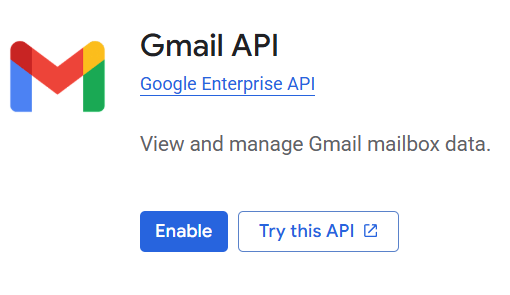
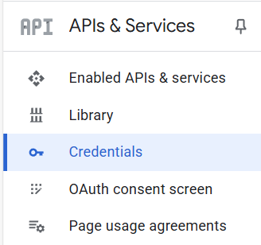
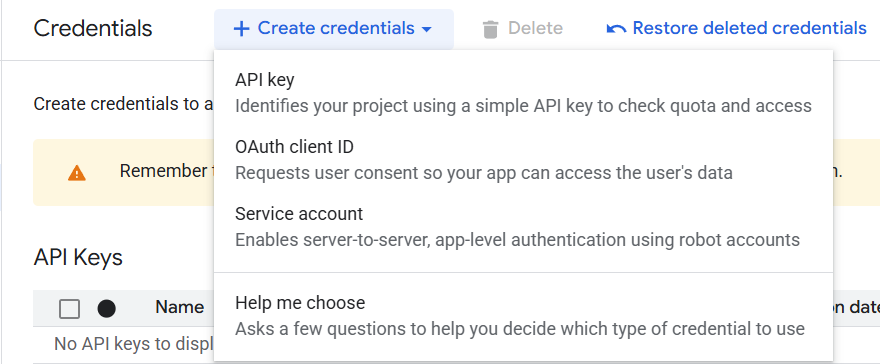
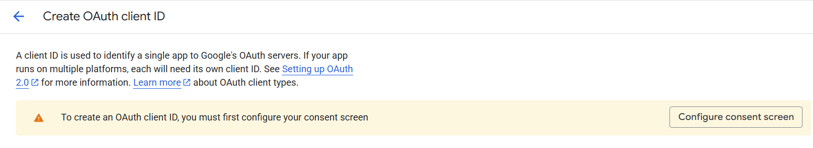

<a id="readme-top"></a>

[![Contributors][contributors-shield]][contributors-url]
[![Forks][forks-shield]][forks-url]
[![Stargazers][stars-shield]][stars-url]
[![Issues][issues-shield]][issues-url]
[![project_license][license-shield]][license-url]


<!-- PROJECT LOGO -->
<br />
<div align="center">
  <a href="https://github.com/jh1923/venmo-gmail-fetch">
  </a>

<h3 align="center">Venmo Transactions from Gmail Fetcher</h3>

  <p align="center">
    Fetches Venmo transaction messages from Gmail and then parses them into dictionaries containing information about the transactions.
    <br />
    <a href="https://github.com/jh1923/venmo-gmail-fetch"><strong>Explore the Repo »</strong></a>
    <br>
    <a href="https://github.com/jh1923/venmo-gmail-fetch/issues/new?labels=bug&template=bug-report---.md">Report Bug</a>
    &middot;
    <a href="https://github.com/jh1923/venmo-gmail-fetch/issues/new?labels=enhancement&template=feature-request---.md">Request Feature</a>
  </p>
</div>

<h2 align="center">⚠️⚠️⚠️ This README is under construction!!! ⚠️⚠️⚠️</h3> 

<!-- TABLE OF CONTENTS -->
<a id="table-of-contents"></a>
<details open>
  <summary>Table of Contents</summary>
  <ul>
    <li>
      <a href="#about-the-project">About The Project</a>
      <ul>
        <li><a href="#built-with">Built With</a></li>
        <li><a href="#design">Design</a></li>
      </ul>
    </li>
    <li>
      <a href="#setup">Setup</a>
      <ol>
        <li><a href="#prerequisites">Prerequisites</a></li>
        <li><a href="#gmail">Gmail Filter and Label</a></li>
        <li><a href="#google-cloud-console">Google Cloud Console</a></li>
        <li><a href="#installation">Installation</a></li>
      </ol>
    </li>
    <li>
      <a href="#usage">Usage</a>
      <ul><li><a href="#scripts">Scripts</a></li></ul>
    </li>
    <li><a href="#contributing">Contributing</a></li>
    <li><a href="#license">License</a></li>
    <li><a href="#acknowledgments">Acknowledgments</a></li>
    <li><a href="#footnotes">Footnotes</a></li>
  </ol>
</details>


<!-- ABOUT THE PROJECT -->
## About The Project  

Venmo does not have an official public API, so services that require information from Venmo (e.g. budgeting apps) can break when Venmo's authentication settings update. This project is meant to be a workaround using Venmo's built-in email notification system.

### Built With

[![Debian][debian]][debian-url]
[![Python][python]][python-url] 
[![Google Cloud][google-cloud]][google-cloud-url]
[![Gmail][gmail]][gmail-url]

### Design


<p align="right"><a href="#table-of-contents">Table of Contents ↑</a></p>

<!-- SETUP -->
## Setup

### Prerequisites

[](https://www.python.org/downloads/release/python-3135/)

- You'll need a Google/Gmail account that is accessible to you in order to fetch emails. 
- You'll also need to sign up for Google Cloud Console if you haven't already (using the same Google account). You can do that [here](https://console.cloud.google.com/).

### Gmail
We need to set up a filter and label to store emails from Venmo for us to parse.
1. Sign in to your Gmail account at https://mail.google.com/.
2. Go to "Settings" > "See all settings" > "[Filters and Blocked Addresses](https://mail.google.com/mail/u/0/#settings/filters)."
3. Add the filter to label your Venmo emails. You can do this in one of two ways:
    - Use the prewritten filter included in this repo at [setup/mailFilters.xml](setup/mailFilters.xml). You should edit the line `<apps:property name='label' value='labelname'/>`, where `labelname` should be the name of the label you want to use; It's set to 'Venmo' by default. Select "Import filters" > "Choose file" and upload the file. Select "Open file" and check the box next to the imported filter as well as "Apply new filters to existing email." Select "Create filters" to create the filter.
    - Create the filter yourself from scratch. Select "Create a new filter" and give it this search criteria[^1]:
        ```
        from:(venmo@venmo.com) “Transaction ID”
        ```  
        

        Now select "Create filter" and check whichever options you want to apply. These steps are necessary:
        - "Apply the label: `labelname`" where `labelname` is the name of the label you're going to use later to parse your Venmo emails.
        - > [!Important] Do NOT check "Mark as read"; the script will parse unread emails in the label and mark them as read afterwards.
        
        I recommend these options as well:
        - "Skip the Inbox (Archive it)" reduces clutter in your email inbox.
        - "Never send it to Spam" 
        - "Also apply filter to matching conversations" if you want to get all of your older Venmo transactions that are still in your inbox.

        Select "Create filter" to create the filter.
        

<p align="right"><a href="#table-of-contents">Table of Contents ↑</a></p>

### Google Cloud Console
We use Google Cloud Console's Gmail API and OAuth token generation to ensure that our script has access to the Gmail inbox where we added our filter and label.

1. Sign in to your Google account at https://console.cloud.google.com/.
2. Go to "Select a project" > "New project" and enter the name of the project;it can be anything, but I suggest something relevant like "Venmo Email Fetcher." Select the "Create" button and you should receive a notification on the site that you've created a new project. Select the project you just created to work in it.
3. Go to "APIs & Services" and select "Enable APIs & Services." Search for and enable "Gmail API."  You should now be able to see the Gmail API in your list of "Enabled APIs & services."
4. In the APIs & services sidebar, select "Credentials."
   
 Select "Create credentials" > "OAuth client ID" > "Configure consent screen" > "Get started."  
 5. Give the app a relevant name and add the user support email. Go through the rest of the process with your information and select "Create" at the end to create the OAuth configuration. 
<a id="credentials-json-download"></a>
 6. Now, in the "OAuth Overview" screen, select "Create OAuth client" and choose "Desktop app" for the application type. With the OAuth client created, select "Download JSON" and save it as "credentials.json." `credentials.json` should look something like this: 
  ```json
    {
        "installed": {
            "client_id": "####-xxxx.apps.googleusercontent.com",
            "project_id": "project-name-476015",
            "auth_uri": "https://accounts.google.com/o/oauth2/auth",
            "token_uri": "https://oauth2.googleapis.com/token",
            "auth_provider_x509_cert_url": "https://www.googleapis.com/oauth2/v1/certs",
            "client_secret": "XXXX-xxxx",
            "redirect_uris": [
                "http://localhost"
            ]
        }
    }
  ```


### Installation

> [!TIP]
> Using a virtual environment is recommended in order to keep your system environment clean. 

Create a virtual environment in this directory by running:
  ```sh 
  python -m venv .venv
  ```
  Then, enter the virtual environment
  ```sh
  source .venv/bin/activate
  ```
  and exit the environment at any time by running `deactivate`.

1. Clone the repo
   ```sh
   git clone https://github.com/jh1923/venmo-gmail-fetch.git
   ```
2. Install packages
   ```sh
   pip install -r scripts/requirements.txt
   ```
3. Upload your Google Cloud Console project credentials file

<p align="right"><a href="#table-of-contents">Table of Contents ↑</a></p>

<!-- USAGE EXAMPLES -->
## Usage
In the root directory of this repo, add a `.env` file with these attributes, with the values changed according to your preferences:
```
LABEL_NAME="Venmo"
CREDENTIALS_PATH=credentials/credentials.json_example
TOKEN_PATH=credentials/token.json
LOG_PATH="results.log"
```
- `LABEL_NAME` is the name of the [label you set in Gmail](#gmail).
- `CREDENTIALS_PATH` points to the `credentials.json` file you saved from [creating the OAuth client](#credentials-json-download).
-  `LOG_PATH` is the place where you want the log file to be created.
- `TOKEN_PATH` is the place where you want the token file to be created.

You can run the main script directly in the terminal with this command:
```sh
python src/venmo_email_fetch.py
```
### Scripts
There are some scripts in the [scripts/](scripts) directory for running and testing code.

<p align="right"><a href="#table-of-contents">Table of Contents ↑</a></p>

<!-- CONTRIBUTING -->
## Contributing

1. Fork the Project
2. Create your Feature Branch (`git checkout -b feature/AmazingFeature`)
3. Commit your Changes (`git commit -m 'Add some AmazingFeature'`)
4. Push to the Branch (`git push origin feature/AmazingFeature`)
5. Open a Pull Request

<!-- LICENSE -->
## License

Distributed under the MIT License. See [LICENSE.txt](LICENSE.txt) for more information.

<!-- ACKNOWLEDGMENTS -->
## Acknowledgments

* The [README template](https://github.com/othneildrew/Best-README-Template/blob/main/BLANK_README.md) used for this project was created by [othneildrew](https://github.com/othneildrew).
* Badges are sourced from [Shields.io](https://shields.io/badges/static-badge).


## Footnotes
        
[^1]: This is how we ensure that all emails in our filter are associated with Venmo transactions, because they all have a Transaction ID.

<p align="right"><a href="#table-of-contents">Table of Contents ↑</a></p>

<!-- MARKDOWN LINKS & IMAGES -->
<!-- https://www.markdownguide.org/basic-syntax/#reference-style-links -->
[contributors-shield]: https://img.shields.io/github/contributors/jh1923/venmo-gmail-fetch.svg?style=for-the-badge
[contributors-url]: https://github.com/jh1923/venmo-gmail-fetch/graphs/contributors
[forks-shield]: https://img.shields.io/github/forks/jh1923/venmo-gmail-fetch.svg?style=for-the-badge
[forks-url]: https://github.com/jh1923/venmo-gmail-fetch/network/members
[stars-shield]: https://img.shields.io/github/stars/jh1923/venmo-gmail-fetch.svg?style=for-the-badge
[stars-url]: https://github.com/jh1923/venmo-gmail-fetch/stargazers
[issues-shield]: https://img.shields.io/github/issues/jh1923/venmo-gmail-fetch.svg?style=for-the-badge
[issues-url]: https://github.com/jh1923/venmo-gmail-fetch/issues
[license-shield]: https://img.shields.io/github/license/jh1923/venmo-gmail-fetch.svg?style=for-the-badge
[license-url]: https://github.com/jh1923/venmo-gmail-fetch/blob/master/LICENSE.txt
[linkedin-shield]: https://img.shields.io/badge/-LinkedIn-black.svg?style=for-the-badge&logo=linkedin&colorB=555
[linkedin-url]: https://linkedin.com/in/jh1923

<!-- Shields.io badges. You can a comprehensive list with many more badges at: https://github.com/inttter/md-badges -->
[google-cloud]: https://img.shields.io/badge/Google%20Cloud-%234285F4.svg?logo=google-cloud&logoColor=white
[google-cloud-url]: https://cloud.google.com/
[python]: https://img.shields.io/badge/Python-3776AB?logo=python&logoColor=fff
[python-url]: https://www.python.org/
[debian]: https://img.shields.io/badge/Debian-A81D33?logo=debian&logoColor=fff
[debian-url]: https://www.debian.org/
[gmail]: https://img.shields.io/badge/Gmail-D14836?logo=gmail&logoColor=white
[gmail-url]: https://mail.google.com/