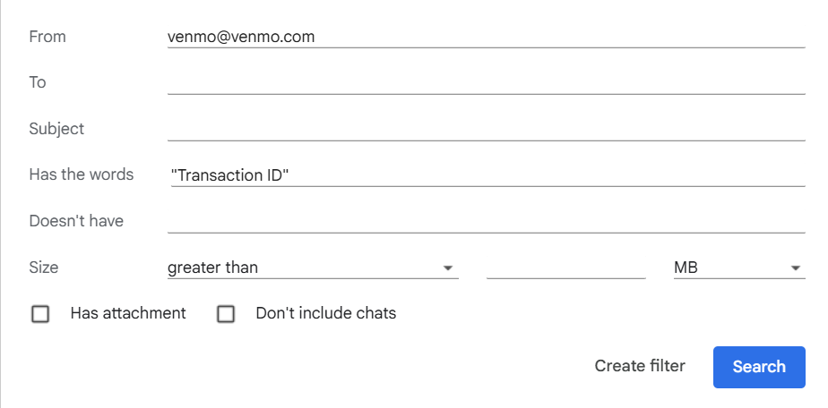
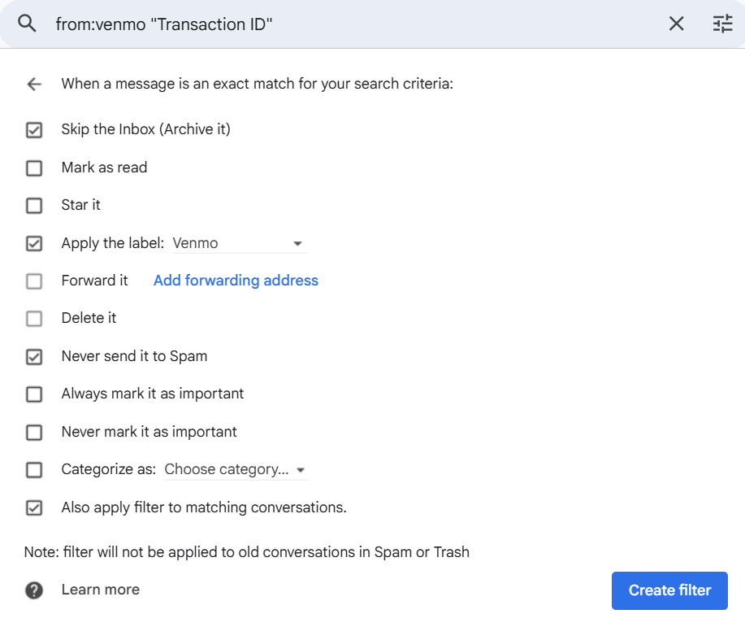

<a id="readme-top"></a>

[![Contributors][contributors-shield]][contributors-url]
[![Forks][forks-shield]][forks-url]
[![Stargazers][stars-shield]][stars-url]
[![Issues][issues-shield]][issues-url]
[![project_license][license-shield]][license-url]
[![LinkedIn][linkedin-shield]][linkedin-url]

<!-- PROJECT LOGO -->
<br />
<div align="center">
  <a href="https://github.com/jh1923/venmo-gmail-fetch">
  </a>

<h3 align="center">Venmo Transactions from Gmail Fetcher</h3>

  <p align="center">
    Fetches Venmo transaction messages from Gmail and then parses them into dictionaries containing information about the transactions.
    <br />
    <a href="https://github.com/jh1923/venmo-gmail-fetch"><strong>Explore the Repo »</strong></a>
    <br />
    <br />
    <a href="https://github.com/jh1923/venmo-gmail-fetch/issues/new?labels=bug&template=bug-report---.md">Report Bug</a>
    &middot;
    <a href="https://github.com/jh1923/venmo-gmail-fetch/issues/new?labels=enhancement&template=feature-request---.md">Request Feature</a>
  </p>
</div>


<!-- TABLE OF CONTENTS -->
<details open>
  <summary>Table of Contents</summary>
  <ol>
    <li>
      <a href="#about-the-project">About The Project</a>
      <ul>
        <li><a href="#built-with">Built With</a></li>
      </ul>
    </li>
    <li>
      <a href="#getting-started">Getting Started</a>
      <ul>
        <li><a href="#prerequisites">Prerequisites</a></li>
        <li><a href="#installation">Installation</a></li>
      </ul>
    </li>
    <li><a href="#usage">Usage</a></li>
    <li><a href="#contributing">Contributing</a></li>
    <li><a href="#license">License</a></li>
    <li><a href="#acknowledgments">Acknowledgments</a></li>
  </ol>
</details>


<!-- ABOUT THE PROJECT -->
## About The Project

Venmo does not have an official public API, so services that require information from Venmo (e.g. budgeting apps) can break when Venmo's authentication settings update. This project is meant to be a workaround using Venmo's built-in email notification system.


### Built With

[![Debian][debian]][debian-url]
[![Python][python]][python-url] 
[![Google Cloud][google-cloud]][google-cloud-url]
[![Gmail][gmail]][gmail-url]

<p align="right"><a href="#readme-top" title="Back to Top"></a></p>

<!-- GETTING STARTED -->
## Setup

This is an example of how you may give instructions on setting up your project locally.
To get a local copy up and running follow these simple example steps.

### Prerequisites

[](https://www.python.org/downloads/release/python-3135/)

- You'll need a Google/Gmail account that is accessible to you in order to fetch emails. 
- You'll also need to sign up for Google Cloud Console if you haven't already (using the same Google account). You can do that [here](https://console.cloud.google.com/).

### Gmail
We need to set up a filter and label to store emails from Venmo for us to parse.
1. Sign in to your Gmail account at https://mail.google.com/.
2. Go to "Settings" > "See all settings" > "[Filters and Blocked Addresses](https://mail.google.com/mail/u/0/#settings/filters)."
3. Add the filter to label your Venmo emails. You can do this in one of two ways:
    - Use the prewritten filter included in this repo at [setup/mailFilters.xml](setup/mailFilters.xml). You should edit the line `<apps:property name='label' value='labelname'/>`, where `labelname` should be the name of the label you want to use; It's set to 'Venmo' by default. Select "Import filters" > "Choose file" and upload the file. Select "Open file" and check the box next to the imported filter as well as "Apply new filters to existing email." Select "Create filters" to create the filter.
    - Create the filter yourself from scratch. Select "Create a new filter" and give it this search criteria[^1]:
        ```
        from:(venmo@venmo.com) “Transaction ID”
        ```  
        

        Now select "Create filter" and check whichever options you want to apply. These steps are necessary:
        - "Apply the label: `labelname`" where `labelname` is the name of the label you're going to use later to parse your Venmo emails.
        - > [!Important] Do NOT check "Mark as read"; the script will parse unread emails in the label and mark them as read afterwards.
        
        I recommend these options as well:
        - "Skip the Inbox (Archive it)" reduces clutter in your email inbox.
        - "Never send it to Spam" 
        - "Also apply filter to matching conversations" if you want to get all of your older Venmo transactions that are still in your inbox.

        Select "Create filter" to create the filter.
        
        
        
[^1]: This is how we ensure that all emails in our filter are associated with Venmo transactions, because they all have a Transaction ID.

### Google Cloud Console
We use Google Cloud Console's Gmail API and OAuth token to ensure that our script has access to the Gmail inbox where we added our filter and label.

### Installation

> [!TIP]
> Using a virtual environment is recommended in order to keep your system environment clean. Create a virtual environment in this directory by running:
  ```sh 
  python -m venv /path/to/new/virtual/env
  ```
  > Then, enter the virtual environment
  ```sh
  source /path/to/new/virtual/env/bin/activate
  ```
  > and exit the environment at any time by running `deactivate`.

1. Clone the repo
   ```sh
   git clone https://github.com/jh1923/venmo-gmail-fetch.git
   ```
2. Install packages
   ```sh
   pip install -r scripts/requirements.txt
   ```
3. Upload your Google Cloud Console project credentials file
4. 

<p align="right"><a href="#readme-top" title="Back to Top"></a></p>


<!-- USAGE EXAMPLES -->
## Usage

Use this space to show useful examples of how a project can be used. Additional screenshots, code examples and demos work well in this space. You may also link to more resources.

_For more examples, please refer to the [Documentation](https://example.com)_

<p align="right"><a href="#readme-top" title="Back to Top"></a></p>


<!-- CONTRIBUTING -->
## Contributing

1. Fork the Project
2. Create your Feature Branch (`git checkout -b feature/AmazingFeature`)
3. Commit your Changes (`git commit -m 'Add some AmazingFeature'`)
4. Push to the Branch (`git push origin feature/AmazingFeature`)
5. Open a Pull Request

<p align="right"><a href="#readme-top" title="Back to Top"></a></p>


<!-- LICENSE -->
## License

Distributed under the MIT License. See [LICENSE.txt](LICENSE.txt) for more information.

<p align="right"><a href="#readme-top" title="Back to Top"></a></p>

<!-- ACKNOWLEDGMENTS -->
## Acknowledgments

* The [README template](https://github.com/othneildrew/Best-README-Template/blob/main/BLANK_README.md) used for this project was created by [othneildrew](https://github.com/othneildrew).
* Badges from [Shields.io](https://shields.io/badges/static-badge).
* []()

<p align="right"><a href="#readme-top" title="Back to Top"></a></p>


<!-- MARKDOWN LINKS & IMAGES -->
<!-- https://www.markdownguide.org/basic-syntax/#reference-style-links -->
[contributors-shield]: https://img.shields.io/github/contributors/jh1923/venmo-gmail-fetch.svg?style=for-the-badge
[contributors-url]: https://github.com/jh1923/venmo-gmail-fetch/graphs/contributors
[forks-shield]: https://img.shields.io/github/forks/jh1923/venmo-gmail-fetch.svg?style=for-the-badge
[forks-url]: https://github.com/jh1923/venmo-gmail-fetch/network/members
[stars-shield]: https://img.shields.io/github/stars/jh1923/venmo-gmail-fetch.svg?style=for-the-badge
[stars-url]: https://github.com/jh1923/venmo-gmail-fetch/stargazers
[issues-shield]: https://img.shields.io/github/issues/jh1923/venmo-gmail-fetch.svg?style=for-the-badge
[issues-url]: https://github.com/jh1923/venmo-gmail-fetch/issues
[license-shield]: https://img.shields.io/github/license/jh1923/venmo-gmail-fetch.svg?style=for-the-badge
[license-url]: https://github.com/jh1923/venmo-gmail-fetch/blob/master/LICENSE.txt
[linkedin-shield]: https://img.shields.io/badge/-LinkedIn-black.svg?style=for-the-badge&logo=linkedin&colorB=555
[linkedin-url]: https://linkedin.com/in/jh1923

<!-- Shields.io badges. You can a comprehensive list with many more badges at: https://github.com/inttter/md-badges -->
[google-cloud]: https://img.shields.io/badge/Google%20Cloud-%234285F4.svg?logo=google-cloud&logoColor=white
[google-cloud-url]: https://cloud.google.com/
[python]: https://img.shields.io/badge/Python-3776AB?logo=python&logoColor=fff
[python-url]: https://www.python.org/
[debian]: https://img.shields.io/badge/Debian-A81D33?logo=debian&logoColor=fff
[debian-url]: https://www.debian.org/
[gmail]: https://img.shields.io/badge/Gmail-D14836?logo=gmail&logoColor=white
[gmail-url]: https://mail.google.com/